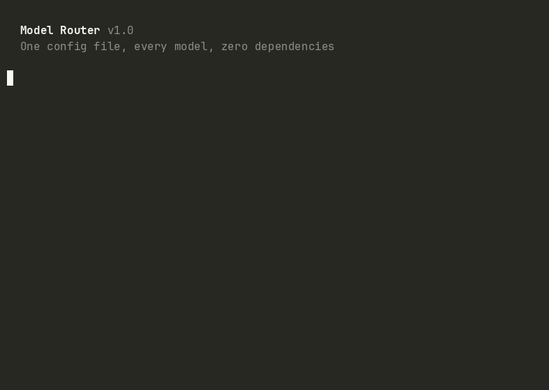

<h1 align="center">Model Router</h1>

[](https://github.com/FvdHMBAI/agent-stack)

<p align="center">
  <strong>The LLM router that lives in your shell.</strong><br>
  One config file. Every model. Zero dependencies beyond <code>bash</code> and <code>jq</code>.
</p>

<p align="center">
  <a href="https://github.com/FvdHMBAI/model-router/actions"></a>&nbsp;
  <a href="https://github.com/FvdHMBAI/model-router/stargazers"></a>&nbsp;
  <a href="LICENSE"></a>
</p>

<p align="center">
  <a href="#the-story">Story</a> · 
  <a href="#quick-start">Quick Start</a> · 
  <a href="#how-it-compares">Comparison</a> · 
  <a href="#tiers">Tiers</a> · 
  <a href="#configuration">Config</a> · 
  <a href="#the-agentstack-ecosystem">Ecosystem</a>
</p>

---

## The Story

When Anthropic shipped Claude Sonnet 5, we updated one JSON file. 30 scripts, 225 cron jobs, 5 MCP servers picked up the new model instantly. Zero downtime. Zero grep. Zero 2 AM incidents.

The week before, a friend's team spent two days hunting down hardcoded model names across their automation stack. They found most of them. One cron job broke at 3 AM because nobody remembered the `claude-sonnet-4` reference buried in a health check script.

That's the problem Model Router solves. Not with a Python proxy. Not with a SaaS gateway. With ~300 lines of bash.

```
  ┌──────────────────────────────────────────────────────────────┐
  │  $ eval $(model-router standard)                             │
  │  $ echo "$MODEL_ID $MODEL_PROVIDER $MODEL_EFFORT"           │
  │                                                              │
  │  claude-sonnet-5 anthropic medium                            │
  │                                                              │
  │  $ eval $(model-router heavy)                                │
  │  $ echo "$MODEL_ID"                                          │
  │                                                              │
  │  claude-opus-5                                               │
  │                                                              │
  │  $ eval $(model-router local)                                │
  │  $ echo "$MODEL_ID $MODEL_PROVIDER"                          │
  │                                                              │
  │  qwen3:8b ollama                                             │
  └──────────────────────────────────────────────────────────────┘
```

Scripts say `standard`, not `claude-sonnet-5`. The mapping lives in one config. When the model changes, the config changes. Everything else stays.

---

<p align="center">
  
</p>

---

## The Two Ideas

Model Router fixes the hardcoded-model-name problem with two principles:

1. **Tiers, not model names.** Your scripts request a capability level (`standard`, `heavy`, `local`). The config resolves it to a specific model. When providers ship updates, you change one file.

2. **Automatic fallback.** Provider down? Config corrupt? Safe defaults kick in. Your 2 AM cron job survives.

## Quick Start

```bash
git clone https://github.com/FvdHMBAI/model-router.git
cd model-router && ./install.sh
```

Or just copy two files:

```bash
cp model-router.sh /usr/local/bin/model-router
cp model-routing.json ~/.config/model-router/model-routing.json
export MODEL_ROUTER_CONFIG="$HOME/.config/model-router/model-routing.json"
```

Then use it:

```bash
# Standard task (reviews, tickets, content)
eval $(model-router standard)
echo "$MODEL_ID"        # claude-sonnet-5

# Heavy task (debugging, architecture)
eval $(model-router heavy)
# -> claude-opus-5, effort=high

# Free local model (triage, classification)
eval $(model-router local)
# -> qwen3:8b via Ollama
```

Use it in an API call:

```bash
eval $(model-router standard)
curl -s https://api.anthropic.com/v1/messages \
  -H "x-api-key: $ANTHROPIC_API_KEY" \
  -H "anthropic-version: 2023-06-01" \
  -H "content-type: application/json" \
  -d "$(jq -n \
    --arg model "$MODEL_ID" \
    --argjson max_tokens "$MODEL_MAX_TOKENS" \
    '{model: $model, max_tokens: $max_tokens,
      messages: [{role: "user", content: "Hello"}]}')"
```

## How It Compares

| Feature | model-router | LiteLLM | OpenRouter | Portkey |
|---------|:---:|:---:|:---:|:---:|
| Shell-native (`eval` output) | **Yes** | No | No | No |
| Zero dependencies | **bash + jq** | Python + pip | SaaS | Node.js |
| Self-hosted | **Yes** | Yes | No | Yes |
| No server/proxy needed | **Yes** | No (proxy) | No (API) | No (gateway) |
| Provider health checks | **Yes** | Yes | N/A | Yes |
| Cost tracking | **Yes** | Yes | Yes | Yes |
| Latency benchmarks | **Yes** | No | No | Yes |
| Eval-injection safe | **Yes** | N/A | N/A | N/A |
| Lines of code | **~300** | 50,000+ | Closed | 20,000+ |
| Setup time | **30 seconds** | Minutes | Account | Minutes |

**When to use model-router:** You write bash. Your AI automation runs in cron jobs, CI pipelines, or shell scripts. You want routing without adding Python, Node.js, or a proxy server to your stack.

**When to use something else:** You need a unified OpenAI-compatible API proxy, SDK support in Python/JS, or request-level load balancing across model replicas.

## In Production

Model Router runs in production across our infrastructure:

| Metric | Value |
|--------|-------|
| Cron jobs routed | **225** |
| Running containers | **81** |
| Routing tiers | **7** (heavy, standard, light, local, local-fast, gemini, mistral) |
| Providers supported | **5** (Anthropic, Google, Mistral, OpenAI, Ollama) |
| Lines of code | **~300** |
| Config files to update | **1** |

## Tiers

| Tier | Default Model | Provider | Use Case | Cost |
|------|--------------|----------|----------|------|
| `heavy` | claude-opus-5 | Anthropic | Debugging, architecture, security | $$$ |
| `standard` | claude-sonnet-5 | Anthropic | Reviews, tickets, content, deployments | $$ |
| `light` | claude-haiku-4-5 | Anthropic | Classification, formatting, health checks | $ |
| `local` | qwen3:8b | Ollama | Triage, docs, simple analysis | Free |
| `local-fast` | qwen2.5:1.5b | Ollama | Keyword extraction, fast classification | Free |
| `gemini` | gemini-2.5-flash | Google | Cross-review, video, large contexts | $ |
| `mistral` | mistral-small-latest | Mistral | EU-hosted, GDPR-compliant workloads | $ |

All tiers are customizable. Add your own in `model-routing.json`.

## Commands

| Command | Description |
|---------|-------------|
| `model-router <tier>` | Output eval-safe variables for a tier |
| `model-router <agent>` | Resolve agent name to tier to model |
| `model-router info` | Show full configuration |
| `model-router health` | Check all provider endpoints |
| `model-router recommend <name>` | Show routing details for an agent or job |
| `model-router cost-report` | Usage summary by provider, tier, and day |
| `model-router benchmark [tier]` | Latency test across providers |
| `model-router init` | Create default config in `~/.config/model-router/` |

## Output Variables

Every routing call sets these eval-safe shell variables:

| Variable | Example | Description |
|----------|---------|-------------|
| `MODEL_ID` | `claude-sonnet-5` | Full model identifier for API calls |
| `MODEL_PROVIDER` | `anthropic` | Provider name |
| `MODEL_TIER` | `standard` | Resolved tier |
| `MODEL_COST_PER_1K_IN` | `0.003` | Input cost per 1K tokens (USD) |
| `MODEL_COST_PER_1K_OUT` | `0.015` | Output cost per 1K tokens (USD) |
| `MODEL_MAX_TOKENS` | `8192` | Maximum output tokens |
| `MODEL_CLI_NAME` | `sonnet` | Short name for CLI tools |
| `MODEL_EFFORT` | `medium` | Reasoning effort hint |

## Agent & Job Mapping

Map your agents and cron jobs to tiers:

```json
{
  "agents": {
    "code-reviewer": "standard",
    "architect": "heavy",
    "formatter": "light"
  },
  "autonomous_jobs": {
    "nightly-scan": "local",
    "weekly-review": "standard"
  }
}
```

Then route by name:

```bash
eval $(model-router code-reviewer)
# Resolves: code-reviewer -> standard -> anthropic/claude-sonnet-5
```

## Resilience

Model Router is designed for unattended operation:

- **Missing config?** Safe hardcoded defaults (heavy=opus, standard=sonnet, light=haiku, local=qwen)
- **Corrupt JSON?** Falls back to defaults, prints `CONFIG_DEGRADED='true'` to stderr
- **Provider down?** Follows the `fallback` chain defined per tier, logs the failover to stderr
- **Eval injection?** All output values are sanitized. Only alphanumeric characters, dots, colons, and hyphens pass through

## Cost Tracking

Every routing call logs to `~/.model-router/usage.log`:

```
2026-08-02T14:30:00Z tier=standard model=claude-sonnet-5 provider=anthropic cost_in=0.003 cost_out=0.015
```

View your usage:

```bash
model-router cost-report
# === Cost Report ===
# By provider (last 30 days):
#   anthropic    142 requests
#   ollama        89 requests
# By tier (last 30 days):
#   standard      98 requests
#   local          89 requests
#   heavy          44 requests
```

## Provider Health Checks

```bash
model-router health
# === Provider Health Check ===
#   anthropic    OK
#   google       OK
#   mistral      OK
#   openai       NO KEY   (set OPENAI_API_KEY)
#   ollama       OK
```

## Configuration

Edit `model-routing.json` to match your setup:

```json
{
  "tiers": {
    "heavy": {
      "provider": "anthropic",
      "model": "claude-opus-5",
      "fallback": "standard",
      "effort": "high",
      "cost_per_1k_input": 0.015,
      "cost_per_1k_output": 0.075
    }
  },
  "providers": {
    "anthropic": {
      "status": "active",
      "api_key_env": "ANTHROPIC_API_KEY",
      "base_url": "https://api.anthropic.com"
    }
  },
  "cost_limits": {
    "daily_eur": 50,
    "monthly_eur": 800,
    "alert_threshold": 0.8
  }
}
```

Override config location:

```bash
export MODEL_ROUTER_CONFIG="/path/to/your/model-routing.json"
```

## Examples

See the [`examples/`](examples/) directory:

- **[ci-pipeline.sh](examples/ci-pipeline.sh)** - Use model-router in CI/CD
- **[cron-job.sh](examples/cron-job.sh)** - Overnight batch processing with local-first routing
- **[multi-provider.sh](examples/multi-provider.sh)** - Provider failover and health demo

## The AgentStack Ecosystem

Model Router is one piece. The full stack:

| Tool | What it does | Link |
|------|-------------|------|
| **[GuardRail](https://github.com/FvdHMBAI/guardrail)** | Pre-execution security for AI agents. 172 guards, 96% enforcement rate. | [Repo](https://github.com/FvdHMBAI/guardrail) |
| **Model Router** | LLM routing from your shell. One config, every model. | You're here |
| **[NightShift](https://github.com/FvdHMBAI/nightshift)** | Overnight code improvement. Lint, types, security, docs. | [Repo](https://github.com/FvdHMBAI/nightshift) |
| **[Graphify](https://github.com/FvdHMBAI/graphify-toolkit)** | Turn any codebase into a queryable knowledge graph. | [Repo](https://github.com/FvdHMBAI/graphify-toolkit) |
| **[Autonomie OS](https://github.com/FvdHMBAI/autonomie-os)** | Self-improving AI agent framework. Learns overnight. | [Repo](https://github.com/FvdHMBAI/autonomie-os) |

All tools are open source. All work standalone. Together they form a governance layer for AI agents.

## Learn More

Want to understand how Model Router fits into a complete AI governance system? The free course covers model routing in Lesson 8:

**[KI-Governance lernen (18 Lektionen, kostenlos)](https://lernen.promptandbuild.de)**

## Requirements

- `bash` 4+
- `jq` (JSON parsing)
- API keys for the providers you use (set via environment variables)

## Contributing

Contributions welcome. Please:

1. Fork the repository
2. Create a feature branch
3. Add tests for new functionality
4. Run `bash tests/test-model-router.sh` before submitting
5. Open a PR

## License

[MIT](LICENSE)

---

<p align="center">
  Built by <a href="https://promptandbuild.de">Prompt & Build</a>.<br>
  Part of <a href="https://github.com/FvdHMBAI/agent-stack">AgentStack</a>: the complete governance layer for AI agents.
</p>
